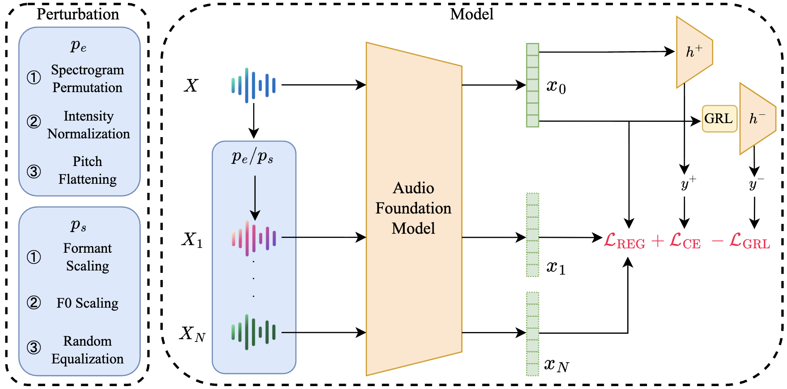

<h1 font-size:40px align="center">N-CORE: N-View Consistency Regularization for Disentangled Representation Learning in Nonverbal Vocalizations</h2>
<h3 font-size:40px align="center">Siddhant Bikram Shah and Kristina T. Johnson</h3>

<p align="center">
  
</p>

This is the code repository for our paper **<a href="https://aclanthology.org/2025.emnlp-main.1693/">N-CORE: N-View Consistency Regularization for Disentangled Representation Learning in Nonverbal Vocalizations**</a> published at EMNLP 2025. 

## Overview

The framework supports two main tasks:
1. **Emotion Classification**: Speaker-invariant emotion recognition using speaker perturbation
2. **Speaker Classification**: Emotion-invariant speaker recognition using emotion perturbation

## Repository Structure

```
N-CORE/
├── config.py                # Configuration classes
├── model.py                 # Model architectures (GRL, HuBERT classifier)
├── perturbation.py          # Audio perturbation methods
├── dataset.py               # Dataset loading and collation
├── trainer.py               # Training loop and utilities
├── utils.py                 # Utility functions
├── emotion_classification.py # Main script for emotion classification
├── speaker_classification.py # Main script for speaker classification
```

## Usage

### Emotion Classification

```bash
python -m ncore.emotion_classification \
    --dataset recanvo \
    --epochs 100 \
    --batch_size 4 \
    --accumulation_steps 4 \
    --num_perturbations 1 \
    --lambda_grl 0.1 \
    --lambda_reg 0.005 \
    --seed 42
```

### Speaker Classification

```bash
python -m ncore.speaker_classification \
    --dataset recanvo \
    --epochs 100 \
    --batch_size 4 \
    --accumulation_steps 4 \
    --perturbation_type affective \
    --num_perturbations 1 \
    --lambda_grl 0.1 \
    --lambda_reg 0.005 \
    --seed 42
```

The CSV file should contain the following columns:
- `Filename`: Path to audio file
- `Emotion_ID`: Numeric emotion ID
- `Participant_ID`: Numeric speaker ID

## Configuration Options

| Parameter | Description | Default |
|-----------|-------------|---------|
| `--epochs` | Number of training epochs | 100 |
| `--batch_size` | Physical batch size | 4 |
| `--accumulation_steps` | Gradient accumulation steps | 4 |
| `--lr` | Learning rate | 1e-5 |
| `--num_perturbations` | Number of perturbed views | 1 |
| `--lambda_grl` | Adversarial loss weight | 0.1 |
| `--lambda_reg` | Correlation loss weight | 0.005 |
| `--grl_alpha` | GRL reversal strength | 1.0 |
| `--patience` | Early stopping patience | 10 |

## Citation

```
@inproceedings{shah2025n,
  title={N-CORE: N-View Consistency Regularization for Disentangled Representation Learning in Nonverbal Vocalizations},
  author={Shah, Siddhant Bikram and Johnson, Kristina T},
  booktitle={Proceedings of the 2025 Conference on Empirical Methods in Natural Language Processing},
  pages={33362--33379},
  year={2025}
}
```
